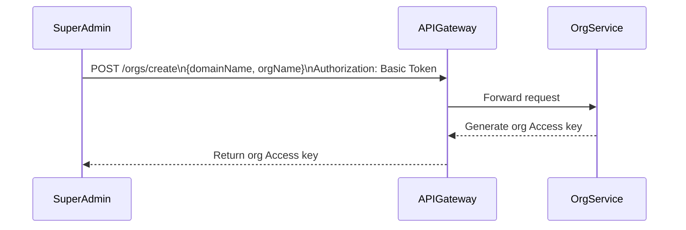
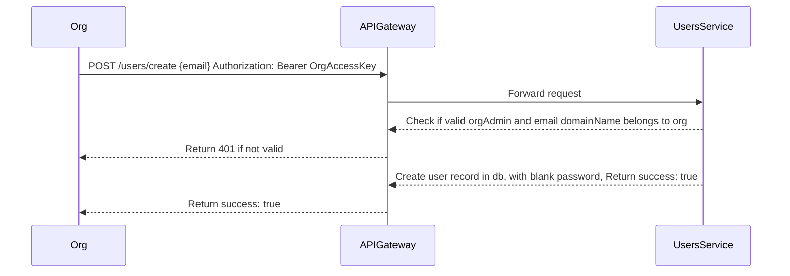
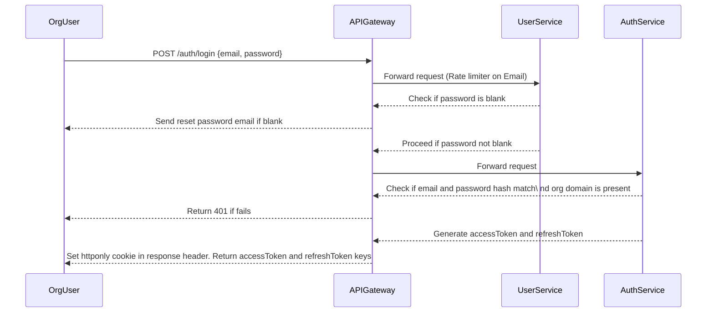
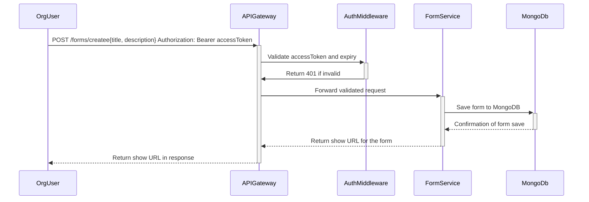
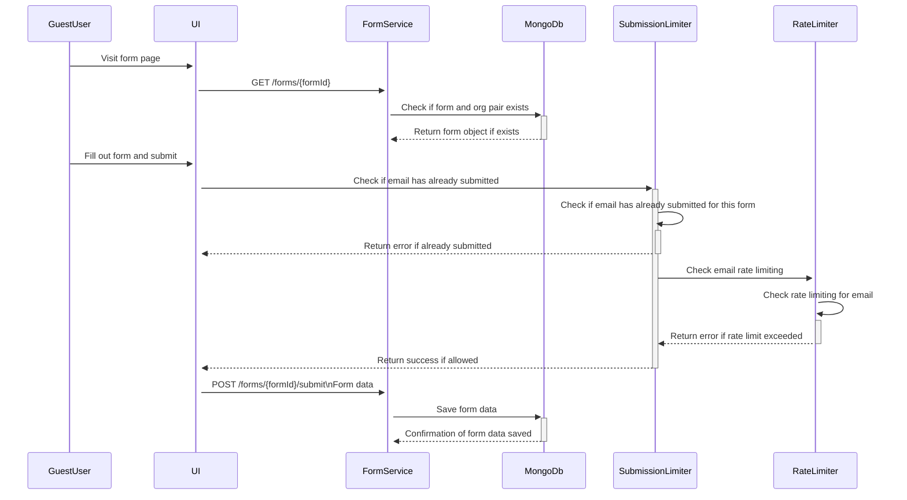
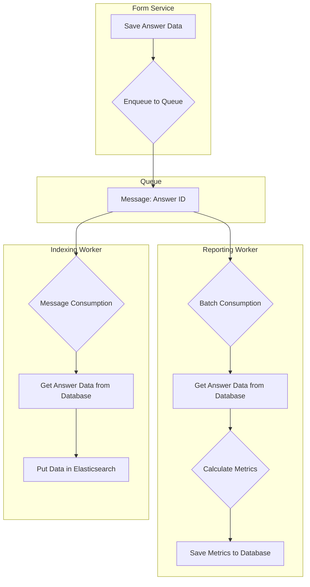

## Assumptions:

Admin accounts can be onboarded by SuperAdmins. And admin needs to preonboard
the users who can login and create survey forms.

### OrgCreation

### OrgUserCreation

### OrgUserLogin

(Rn, the org user has to be created and can be done from the cli app. `node
cmd/cli/index.mjs register:user --email email --password password`)

### OrgUserFormCreation

### Suvery

### Enabling search functions on data or other analytics

